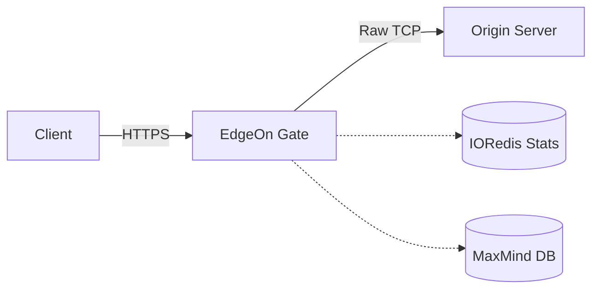

<div align="center">
  
  
  <p style="font-family: 'Trebuchet MS', sans-serif; font-size: 16px; color: #a3a3a3; margin-bottom: 20px;">
    <strong>High-Performance Edge Proxy & Post-Quantum Security Gateway</strong>
  </p>

  <p>
    
    
    
    
  </p>
  <hr style="width: 80%; border: 1px solid #333; margin-bottom: 30px;">
</div>

##  Overview

**Gate** is the core proxy infrastructure of EdgeOn, engineered for extreme throughput and low-latency environments. Built directly on top of `io_uring`, it provides a strictly flexible routing layer that secures external client connections via state-of-the-art Post-Quantum Cryptography while maintaining high-speed, raw plaintext communication with upstream origin servers.

---

##  Architecture & Features

<div style="line-height: 1.8;">

*  **Asynchronous I/O:** Fully utilizes **io_uring** for zero-copy data transfer and maximized kernel-space efficiency.
*  **Quantum-Safe Security:** Integrated with **BoringSSL** and fortified with Post-Quantum Cryptography (**Kyber**).
*  **Advanced Routing (Quiche):** Implements a two-stage accept mechanism. Inbound connections are buffered in memory via a dummy `quiche_config` to extract the Server Name Indication (SNI). The system dynamically provisions the correct SSL certificate before binding the definitive configuration.
*  **Strict Flexible Mode:** Enforces encrypted Client-to-Proxy connections alongside raw, unencrypted Proxy-to-Origin pipelines for internal network optimization.
*  **Protocol Versatility:** Comprehensive **HTTP/1.1** support with active integration mapping for **HTTP/3**.
*  **Traffic Control:** ASN-based firewalling and traffic filtering powered by **MaxMind DB**.
*  **Telemetry Stack:** Real-time operational metrics pushed via **IORedis**, with node-level bandwidth monitoring bound directly to the `io_uring` event loop via **VNStat**.
*  **Enterprise Scalability:** Multi-threaded architecture supporting localized and dynamically routed Custom Error Pages.

</div>

### Network Topology



---

##  Installation Guide

### 1.0 - System Requirements

Deployment requires a compatible Linux distribution with a modern kernel supporting `io_uring`. Verify that `vnstat` is installed on your host system.

The following shared libraries must be available in your build environment:
```text
-lcassandra  -luring  -loqs  -lhiredis  -lz  -lmaxminddb  -lquiche
```

### 1.1 - Building Core Dependencies

Compile and install the necessary submodules before compiling the primary proxy binary.

```bash
git clone https://github.com/wyrexdev/Dotenv.git
cd Dotenv
sudo make && sudo make install
cd ..

git clone https://github.com/edge-on/quiche.git
cd quiche
cargo build --release --features ffi
sudo make install-deps
cd ..
```

### 1.2 - Compiling Gate

Clone the main repository and initialize the build sequence.

```bash
git clone https://github.com/wyrexdev/Gate.git
cd Gate

sudo make

sudo ./Gate
```

---

##  Documentation & Support

For advanced configurations, API gateways, and dashboard integration, refer to the official documentation at [edgeon.io](https://edgeon.io).